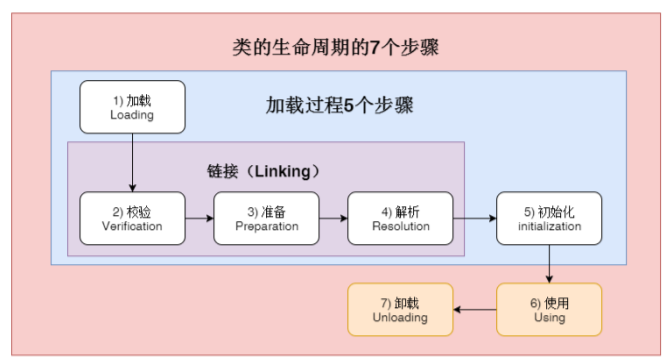

## 类的生命周期

1. 加载：寻找class文件
2. 校验：校验格式、依赖
3. 准备：静态字段、方法表
4. 解析：符号解析为引用
5. 初始化：构造器、静态代码块、静态变量赋值
6. 使用
7. 卸载

### 类的加载时机

1. 当虚拟机启动时，初始化用户指定的主类，就是启动执行的main 方法所在的类
2. new一个实例是初始化目标类
3. 调用静态方法时，初始化静态方法所在的类
4. 访问静态字段时，初始化静态字段所在的类
5. 子类的初始化会触发父类的初始化
6. 如果一个类实现了default方法，那么直接实现或者间接实现该接口的类的初始化会触发该接口的初始化
7. 使用反射API对某个类进行反射调用时，初始化这个类，其实跟前面一样，反射调用 要么是已经有实例了，要么是静态方法，都需要初始化
8. 当初次调用 MethodHandle 实例时，初始化该 MethodHandle 指向的方法所在的 类

### 不会初始化（可能会加载）

1. 通过子类引用父类的静态字段，只会触发父类的初始化，而不会触发子类的初始化。 
2. 定义对象数组，不会触发该类的初始化。 
3. 常量在编译期间会存入调用类的常量池中，本质上并没有直接引用定义常量的类，不会触发定义常量所在的类。 
4. 通过类名获取 Class 对象，不会触发类的初始化，Hello.class 不会让 Hello 类初始
5. 通过 Class.forName 加载指定类时，如果指定参数 initialize 为 false 时，也不会触 发类初始化，其实这个参数是告诉虚拟机，是否要对类进行初始化。Class.forName （“jvm.Hello”）默认会加载 Hello 
6. 通过 ClassLoader 默认的 loadClass 方法，也不会触发初始化动作（加载了，但是不初始化）。

## 类加载器

Java 8的ClassLoader流程：

- bootstrap classloader加载rt.jar，jre/lib/endorsed
- ext classloader加载jre/lib/ext
- application classloader加载-cp指定的类

java9及之后的classloader流程：

- bootstrap classloader加载lib/modules
- ext classloader更名为platform classloader，加载lib/modules
- application classloader加载-cp，-mp指定的类

### 加载器特点

1. 双亲委托：应用类加载器使用一个类时会看父加载器是否有这个类，如果没有，看启动类加载器时候有
2. 负责依赖：加载一个类要负责加载依赖的类
3. 缓存加载：一个类被一个启动器加载后会被缓存起来，只会加载一次

