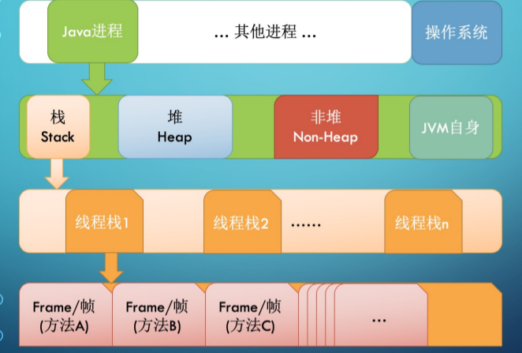

## 写在前面

好文推荐：

* https://zhuanlan.zhihu.com/p/29881777
* https://www.jianshu.com/p/bf158fbb2432

## 什么是JMM

​		JMM 规范明确定义了不同的线程之 间，通过哪些方式，在什么时候可以 看见其他线程保存到共享变量中的 值；以及在必要时，如何对共享变量 的访问进行同步。这样的好处是屏蔽 各种硬件平台和操作系统之间的内存 访问差异，实现了 Java 并发程序真 正的跨平台

## JVM内存整体结构

## JVM栈内存结构

Java 虚拟机栈（Java Virtual Machine Stacks）也是线程私有的，它的生命周期与线程相同。

虚拟机栈描述的是 Java 方法执行的内存模型：每个方法在执行的同时都会创建一个栈帧（Stack Frame，是方法运行时的基础数据结构）用于存储局部变量表、操作数栈、动态链接、方法出口等信息。每一个方法从调用直至执行完成的过程，就对应着一个栈帧在虚拟机栈中入栈到出栈的过程。

在活动线程中，只有位千栈顶的帧才是有效的，称为当前栈帧。正在执行的方法称为当前方法，栈帧是方法运行的基本结构。在执行引擎运行时，所有指令都只能针对当前栈帧进行操作

## JVM堆内存结构

## CPU与内存行为

* CPU 乱序执行 
* volatile 关键字 
* 原子性操作 
* 内存屏障

