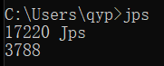
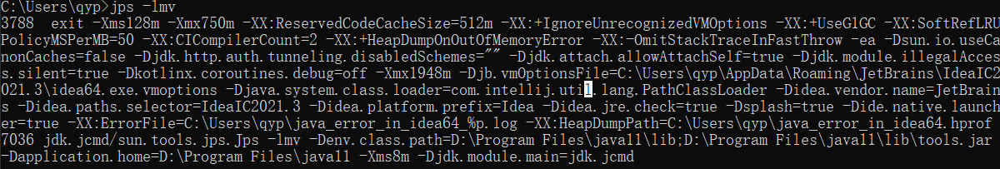
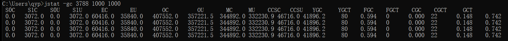
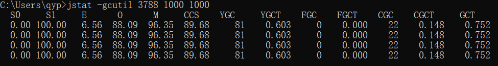
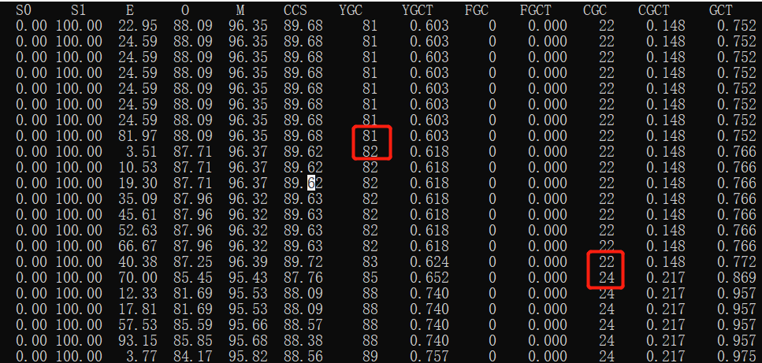
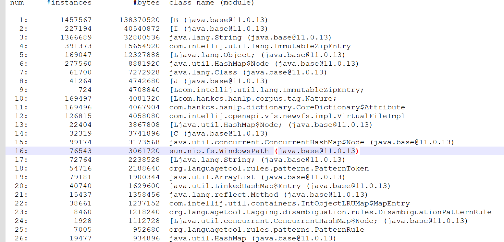
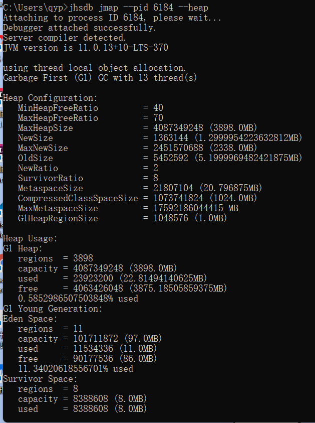

## 概览

| 工具           | 简介                            |
| -------------- | ------------------------------- |
| jps/jinfo      | 查看java进程                    |
| jstat          | 查看jvm内部gc相关信息           |
| jmap           | 查看heap或者类占用空间统计      |
| jstack         | 查看线程信息                    |
| jcmd           | 执行jvm相关分析命令（整合指令） |
| jrunscript/jjs | 执行js命令                      |

## jps/jinfo

查看单个进程运行了什么程序，jvm配置是什么


jps -lmv



jinfo

会展示更多详细的信息

## jstat

jstat -gc  -pid  执行周期  执行次数

按字节展示各个区（新生代、老生代）占用情况，gc次数，gc时间等



jstat -gcutil -pid  执行周期  执行次数

只显示使用率



发生gc



## jmap

常用选项就 3 个：

-heap 打印堆内存（/内存池）的配置和 使用信息。 

```shell
jmap -heap pid
```

-histo 看哪些类占用的空间最多, 直方图 

```shell
jmap -histo pid
```

-dump:format=b,file=xxxx.hprof Dump 堆内存。 

```shell
jmap -dump:format=b,file=3826.hprof 3826 
```

 

### jmap -histo pid



从上图可以看出最多的还是 字节数据、int数组、字符串、类、list、map等实例最多

### jhsdb jmap --pid pid --heap



## jstack

```shell
jstack -l pid
```

## jcmd

Jcmd 综合了前面的几个命令 

示例：

```shell
jcmd pid VM.version 
jcmd pid VM.flags 
jcmd pid VM.command_line 
jcmd pid VM.system_properties 
jcmd pid Thread.print   //线程信息，类似jstack
jcmd pid GC.class_histogram 
jcmd pid GC.heap_info   //堆信息，类似jmap
```

## jrunscript/jjs

当curl命令用： 

jrunscript -e "cat('http://www.baidu.com')" 执行js脚本片段

jrunscript -e "print('hello,kk.jvm'+1)" 执行js文件 

jrunscript -l js -f /XXX/XXX/test.js

