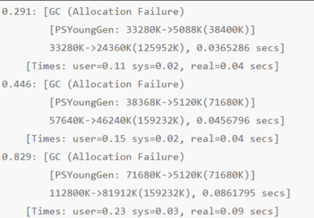
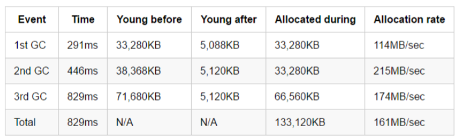
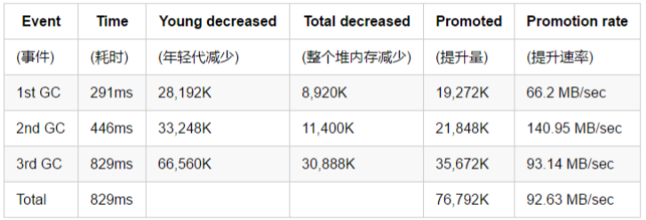

## 高分配速率

### 什么是

分配速率(Allocation rate)表示单位时间内分配的内存量。通常 使用 MB/sec 作为单位。上一次垃圾收集之后，与下一次 GC 开 始之前的年轻代使用量，两者的差值除以时间,就是分配速率。

### 坏作用

分配速率过高就会严重影响程序的性能，在 JVM 中可能会导致巨大的 GC 开销

* 正常系统：分配速率较低于回收速率 -> 健康 

* 内存泄漏：分配速率 持续大于 回收速率 -> OOM 

* 性能劣化：分配速率较高于回收速率 -> 压健康

### 案例

#### 分析

1. JVM 启动之后 291ms，共创建了 33,280 KB 的对 象。第一次 Minor GC（小型GC) 完成后，年轻代 中还有 5,088 KB 的对象存活。

2. 在启动之后 446 ms，年轻代的使用量增加到 38,368 KB，触发第二次 GC，完成后年轻代的使 用量减少到 5,120 KB

3. 在启动之后 829 ms，年轻代的使用量为 71,680 KB，GC 后变为 5,120 KB。

### 解决

思考一个问题，分配速率，到底影响什么？

想一想，new 出来的对象，在什么地方

> Eden

假如我们增加 Eden，会怎么样

> 考虑蓄水池效应

最终的效果是，**影响 Minor GC的次数和时间，进而影响吞吐量**。 

在某些情况下，**只要增加年轻代的大小，即可降低分配速率过高所造成的影响**。 增加年轻代空间并不会降低分配速率，但是会减少 GC 的频率。如果每次 GC 后 只有少量对象存活，minor GC 的暂停时间就不会明显增加

## 过早提升(Premature Promotion)

### 什么是

**提升速率**（promotion rate）用于衡量**单位时间内从年轻代提升到老年代的数据量**。一般使用 MB/sec 作为单位，和分配速率类似。

JVM 会将长时间存活的对象从年轻代提升到老年代。根据分代假设，可能存在一种情况，**老年代中不仅有存活时间长的对象,， 也可能有存活时间短的对象**。这就是过早提升：**对象存活时间还不够长的时候就被提升到了老年代**。 

major GC 不是为频繁回收而设计的，但 major GC 现在也要清理这些生命短暂的对象，就会导致 GC 暂停时间过长。这会严重影响系统的吞吐量

### 表现

* 短时间内频繁地执行 full GC
* 每次 full GC 后老年代的使用率都很低，在10- 20%或以下
* 提升速率接近于分配速率

### 案例

继续分析上一个例子

GC 之前和之后的年轻代使用量以及堆内存使用量。这样就可以通过差值算出老年代的使用量。提升速率影响 major GC 的频率，有大量的对象提升，自然很快将老年代填满。老年代填充的越快，则 major GC 事件的频率就会越高。

### 解决

1. 增加年轻代的大小

> 设置 JVM 启动参数，类似这样：- Xmx64m -XX:NewSize=32m，程序在执行时，Full GC 的次数自然会减少很多，只会对 minor GC 的持续时间产生影响。

2. 减少每次批处理的数量
3. 优化数据结构，减少内存消耗
