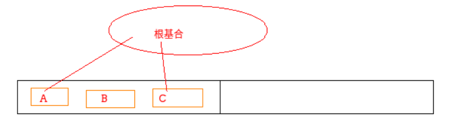
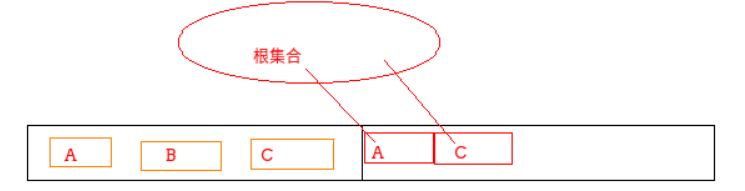
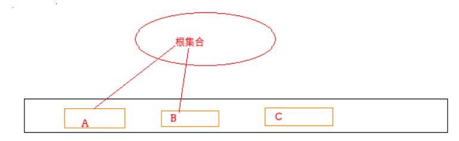
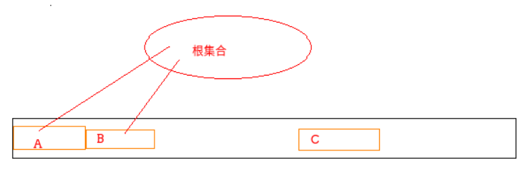
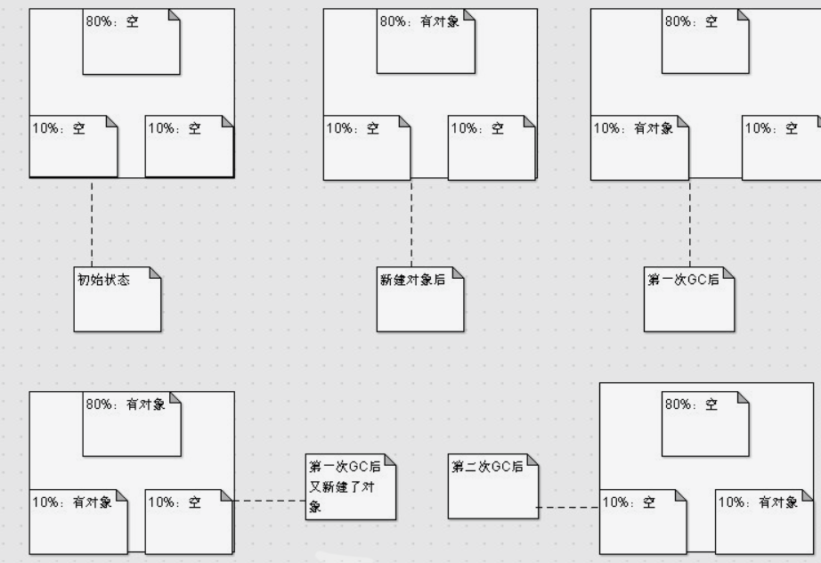

## 为什么要有GC

内存资源是有限的

## 基本原理-标记清除算法

* Marking（标记）: 遍历所有的可达对象，并在本地内存(native)中分门别类记下。 

* Sweeping（清除）: 这一步保证了，不可达对象 所占用的内存，在之后进行内存分配时可以重用。 

  并行 GC 和 CMS 的基本原理。 

  优势：可以处理循环依赖，只扫描部分对象 

  除了清除，还要做压缩。 怎么才能标记和清除清楚上百万对象呢？ 答案就是 **STW**，让全世界停止下来。

## 分代

分代假设：大部分新生对象很快无用； 存活较长时间的对象，可能存活更长时间

不同类型对象不同区域，不同策略处理。

* 对象分配在新生代的 Eden 区， 标记阶段 Eden 区存活的对象就会复制到存活区； 两个存活区 from 和 to，互换角色。对象存活到一定周期会提升到老年代
* 老年代默认都是存活对象，采用移动方式：
  1. 标记所有通过 GC roots 可达的对象；
  2. 删除所有不可达对象；
  3. 整理老年代空间中的内容，方法是将所有的存活对象复制，从老年代空间开始的地方依次存放

## 可以作为 GC Roots 的对象

* 当前正在执行的方法里的局部变量和 输入参数 
* 活动线程（Active threads） 
* 所有类的静态字段（static field） 
* JNI 引用

## 常见垃圾回收算法

### 标记清除

#### 过程

* 第一阶段：标记。从根结点出发遍历对象，对访问过的对象打上标记，表示该对象可达。
* 第二阶段：清除。对那些没有标记的对象进行回收，这样使得不能利用的空间能够重新被利用，回收对象就是把对象作为分块，连接到被称为`空闲链表`的单向链表。之后再分配空间时只需遍历这个**空闲链表**就可以了找到分块了

下图是标记前和标记后内存中堆的状态

下图是清除阶段结束后堆的状态：

#### 分配

回收垃圾的目的是为了能再次分配，当程序申请分块时，怎样才能把大小合适的分块分配给程序呢？以下是分配策略

> `First-fit`：发现大于等于 size的分块立刻返回
> `Best-fit`：找到大小和 size 相等的分块再返回
> ``Worst-fit`：找到最大的分块，然后分割成 size 大小和剩余大小（这种方法容易产生大量小的分块

#### 合并

根据分配策略的不同，分配过程中会出现大量小的分块，如果分块是连续的，我们就可以把小分块合并成一个大的分块，`合并是在清除阶段完成的`，包含了合并策略的清除代码如下

#### 缺点

* 效率不算高
* 在进行GC的时候，需要停止整个应用程序，导致用户体验差
* 这种方式清理出来的空闲内存是不连续的，产生内存碎片。需要维护一个空闲列表。
* 与`写时复制技术`不兼容

> 写时复制（copy-on-write）是众多 UNIX 操作系统用到的内存优化的方法。比如在 Linux 系统中使用 fork() 函数复制进程时，大部分内存空间都不会被复制，只是复制进程，只有在内存中内容被改变时才会复制内存数据。
>
> 但是如果使用标记清除算法，这时内存会被设置`标志位`，就会频繁发生不应该发生的复制

### 复制算法

复制算法将内存划分为两个区间，在任意时间点，所有动态分配的对象都只能分配在其中一个区间（称为活动区间），而另外一个区间（称为空闲区间）则是空闲的

当有效内存空间耗尽时，JVM将暂停程序运行，开启复制算法GC线程。**接下来GC线程会将活动区间内的存活对象，全部复制到空闲区间，且严格按照内存地址依次排列，与此同时，GC线程将更新存活对象的内存引用地址指向新的内存地址**

 在执行GC前, 内存长这样:

 当执行GC后, 内存就变成这样了:

很明显, `复制算法`解决了`标记清除`的一个大问题, 内存碎片化严重. 在这里, 根本不存在碎片化问题的好嘛. 其相比`标记清除`的优势还是有一些的:

1. **内存不会发生碎片化**
2. **最大暂停时间更短**: `复制算法`只需要遍历所有的活动对象, 而不需要遍历堆, 比`标记清除`要少一个堆的遍历, 故而执行更快.
3. **内存分配高效**: `标记清除`是怎么分配内存的? 通过一个空闲地址的链表, 然后挨个找. 而`复制算法`将所有可分配的内存都放到一起了, 直接切割即可.
4. **更好的局部访问**: `复制算法`复制后将对象与子对象放到一起, 这样缓存在读取的时候就能够一起读取, 防止多次读取数据.

当然, 缺点也很明显. 将堆一分为二, 使用效率急速下滑.

1. 堆的使用效率低, 只有1/2
2. 频繁的递归调用函数. 对栈的压力比较大, 但是我们都知道, 所有用递归能写的都可以换成循环来实现, 所以个人感觉这个并不是问题

### 标记整理

标记/整理算法与标记/清除算法非常相似

#### 过程

标记：它的第一个阶段与标记/清除算法是一模一样的，均是遍历GC Roots，然后将存活的对象标记。

整理：移动所有存活的对象，且按照内存地址次序依次排列，然后将末端内存地址以后的内存全部回收。因此，第二阶段才称为整理阶段

在GC执行前的内存：

GC执行后的内存：

#### 实现

如何实现上面的操作呢? 首先, 要将所有活动对象标记出来. 这是标记阶段, 跳过了, 跟`标记清除`一样操作就行. (这里每个对象都有一个`mark`属性, true为活动对象)

标记完了, 那就剩下压缩操作了. 如何进行呢?

1. 遍历堆, 将所有活动对象挪到左边. 但是, 后面有对象引用了前边的对象, 你就找不到新的指针了, 因为那块地址很可能已经被覆盖了.
2. ....

最后想了想, 还是得老老实实地三步走:

1. 遍历堆, 将所有对象通过计算得到新的地址并保存
2. 遍历堆, 将所有子对象的地址更新为新的地址, 同时更新根集合中的指针.
3. 遍历堆, 将对象集体迁移. 指针的问题都解决了, 可以将对象搬到新家了.

#### 缺点

* 效率不高

## GC算法总结

三种算法的**共同点**

1. 三个算法都基于根搜索算法去判断一个对象是否应该被回收，而支撑根搜索算法可以正常工作的理论依据，就是语法中变量作用域的相关内容。因此，要想防止内存泄露，最根本的办法就是掌握好变量作用域，而不应该使用前面内存管理杂谈一章中所提到的C/C++式内存管理方式。**

2. 在GC线程开启时，或者说GC过程开始时，它们都要暂停应用程序（stop the world）

**区别**

* 效率：复制算法>标记/整理算法>标记/清除算法（此处的效率只是简单的对比时间复杂度，实际情况不一定如此）。

* 内存整齐度：复制算法=标记/整理算法>标记/清除算法。

* 内存利用率：标记/整理算法=标记/清除算法>复制算法。

## 分代垃圾回收

### 对象分类

内存中的对象按照生命周期的长短大致可以分为三种，以下命名均为个人的命名。

​     1、**夭折对象**：朝生夕灭的对象，通俗点讲就是活不了多久就得死的对象。

​       **例子**：某一个方法的局域变量、循环内的临时变量等等。

​     2、**老不死对象**：这类对象一般活的比较久，岁数很大还不死，但归根结底，老不死对象也几乎早晚要死的，但也只是几乎而已。

​       **例子**：缓存对象、数据库连接对象、单例对象（单例模式）等等。

​     3、**不灭对象**：此类对象一般一旦出生就几乎不死了，它们几乎会一直永生不灭，记得，只是几乎不灭而已。

​       **例子**：String池中的对象（享元模式）、加载过的类信息等等。

### 对象对应的内存区域

夭折对象和老不死对象都在JAVA堆，而不灭对象在方法区。

JAVA堆，JVM规范要求必须实现GC，然而JVM规范对方法区的GC并不做要求

分代回收算法就是针对的JAVA堆而设计的

### JAVA堆的对象回收

#### 夭折对象

这类对象朝生夕灭，存活时间短，还记得复制算法的使用要求吗？那就是对象存活率不能太高，因此**夭折对象是最适合使用复制算法的**

GC流程：

* **第一点是使用这样的方式，我们只浪费了10%的内存，这个是可以接受的，因为我们换来了内存的整齐排列与GC速度。**
* **第二点是，这个策略的前提是，每次存活的对象占用的内存不能超过这10%的大小，一旦超过，多出的对象将无法复制**。

​     为了解决上面的意外情况，也就是存活对象占用的内存太大时的情况，高手们将JAVA堆分成两部分来处理，上述三个区域则是第一部分，**称为新生代或者年轻代**。而余下的一部分，专门存放老不死对象的则称为**年老代**

#### 老不死对象

这一类对象存活率非常高，因为它们大多是从新生代转过来的。

通常情况下，以下两种情况发生的时候，对象会从新生代区域转到年老带区域。

​     **1、**在新生代里的每一个对象，都会有一个**年龄**，当这些对象的年龄到达一定程度时（年龄就是熬过的GC次数，每次GC如果对象存活下来，则年龄加1），则会被转到年老代，而这个转入年老代的年龄值，一般在JVM中是可以设置的。

​     **2、**在新生代存活对象占用的内存超过10%时，则多余的对象会放入年老代。这种时候，年老代就是新生代的“备用仓库”。

​     针对老不死对象的特性，显然不再适合使用复制算法，因为它的存活率太高，而且不要忘了，如果年老代再使用复制算法，它可是没有备用仓库的。因此一般针对**老不死对象只能采用标记/整理或者标记/清除算法**。

#### 方法区的对象回收（不灭对象）

不灭对象存在于方法区，在我们常用的hotspot虚拟机（JDK默认的JVM）中，方法区也被亲切的称为**永久代**，由于都没有“备用仓库”，二者都是只能使用标记/清除和标记/整理算法

#### 回收的时机

JVM在进行GC时，并非每次都对上面三个内存区域一起回收的，大部分时候回收的都是指新生代。因此GC按照回收的区域又分了两种类型：

**普通GC（minor GC）**：只针对新生代区域的GC。

**全局GC（major GC or Full GC）**：针对年老代的GC，偶尔伴随对新生代的GC以及对永久代的GC。

由于年老代与永久代相对来说GC效果不好，而且二者的内存使用增长速度也慢，因此一般情况下，需要经过好几次普通GC，才会触发一次全局GC

## 相关文章

[GC算法]: https://www.cnblogs.com/hujingnb/category/1683764.html
[GC算法]: https://www.cnblogs.com/zuoxiaolong/p/jvm5.html

感谢各位大佬！

