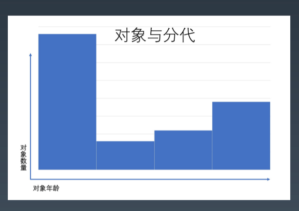
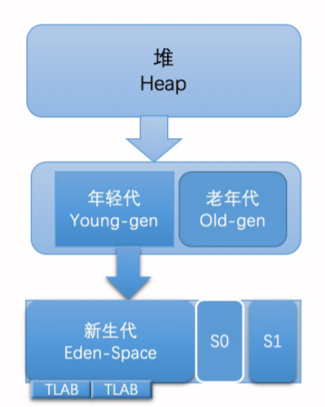
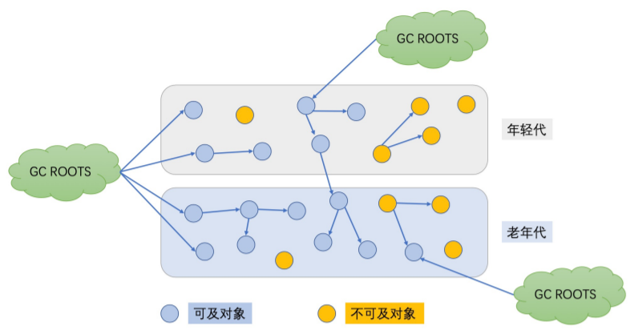
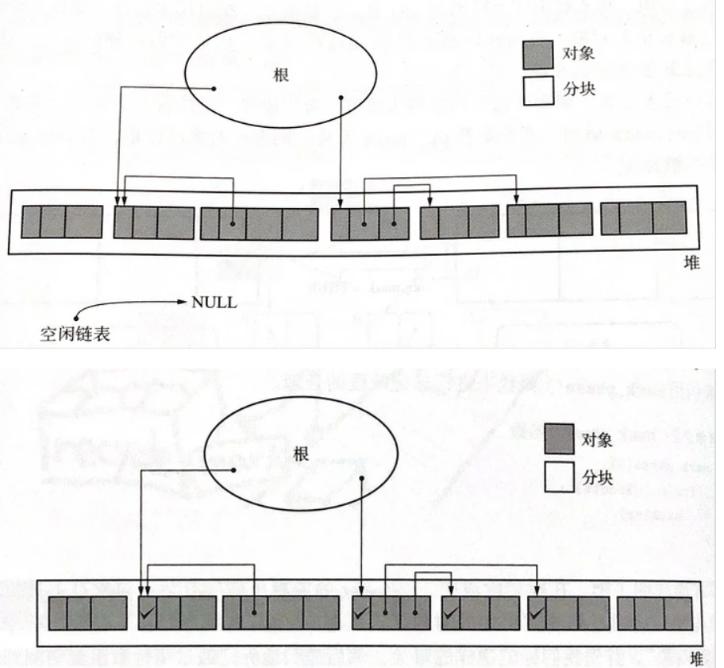
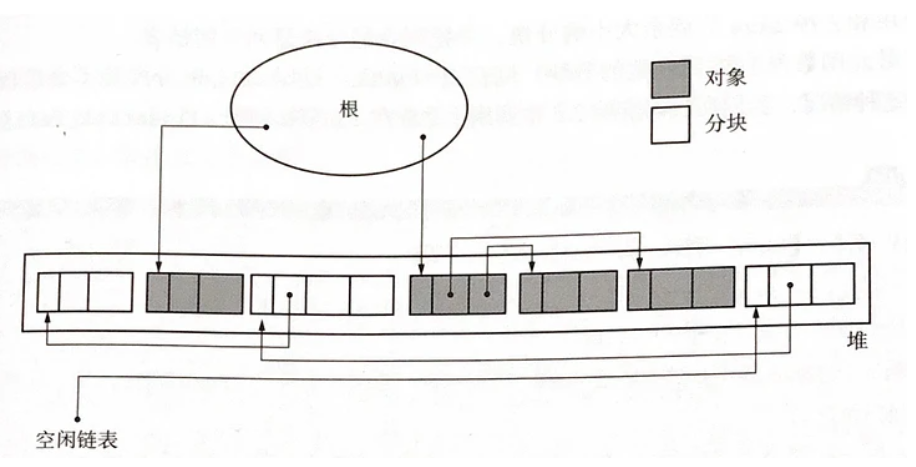

## 为什么要有GC

内存资源是有限的

## 基本原理-标记清除算法

* Marking（标记）: 遍历所有的可达对象，并在本地内存(native)中分门别类记下。 

* Sweeping（清除）: 这一步保证了，不可达对象 所占用的内存，在之后进行内存分配时可以重用。 

  并行 GC 和 CMS 的基本原理。 

  优势：可以处理循环依赖，只扫描部分对象 

  除了清除，还要做压缩。 怎么才能标记和清除清楚上百万对象呢？ 答案就是 **STW**，让全世界停止下来。

## 分代

分代假设：大部分新生对象很快无用； 存活较长时间的对象，可能存活更长时间

不同类型对象不同区域，不同策略处理。

* 对象分配在新生代的 Eden 区， 标记阶段 Eden 区存活的对象就会复制到存活区； 两个存活区 from 和 to，互换角色。对象存活到一定周期会提升到老年代
* 老年代默认都是存活对象，采用移动方式：
  1. 标记所有通过 GC roots 可达的对象；
  2. 删除所有不可达对象；
  3. 整理老年代空间中的内容，方法是将所有的存活对象复制，从老年代空间开始的地方依次存放

## 可以作为 GC Roots 的对象

* 当前正在执行的方法里的局部变量和 输入参数 
* 活动线程（Active threads） 
* 所有类的静态字段（static field） 
* JNI 引用

## 常见垃圾回收算法

### 标记清除

#### 过程

* 第一阶段：标记。从根结点出发遍历对象，对访问过的对象打上标记，表示该对象可达。
* 第二阶段：清除。对那些没有标记的对象进行回收，这样使得不能利用的空间能够重新被利用，回收对象就是把对象作为分块，连接到被称为`空闲链表`的单向链表。之后再分配空间时只需遍历这个**空闲链表**就可以了找到分块了

下图是标记前和标记后内存中堆的状态

下图是清除阶段结束后堆的状态：

#### 分配

回收垃圾的目的是为了能再次分配，当程序申请分块时，怎样才能把大小合适的分块分配给程序呢？以下是分配策略

> `First-fit`：发现大于等于 size的分块立刻返回
> `Best-fit`：找到大小和 size 相等的分块再返回
> ``Worst-fit`：找到最大的分块，然后分割成 size 大小和剩余大小（这种方法容易产生大量小的分块

#### 合并

根据分配策略的不同，分配过程中会出现大量小的分块，如果分块是连续的，我们就可以把小分块合并成一个大的分块，`合并是在清除阶段完成的`，包含了合并策略的清除代码如下

#### 缺点

* 效率不算高
* 在进行GC的时候，需要停止整个应用程序，导致用户体验差
* 这种方式清理出来的空闲内存是不连续的，产生内存碎片。需要维护一个空闲列表。
* 与`写时复制技术`不兼容

> 写时复制（copy-on-write）是众多 UNIX 操作系统用到的内存优化的方法。比如在 Linux 系统中使用 fork() 函数复制进程时，大部分内存空间都不会被复制，只是复制进程，只有在内存中内容被改变时才会复制内存数据。
>
> 但是如果使用标记清除算法，这时内存会被设置`标志位`，就会频繁发生不应该发生的复制

