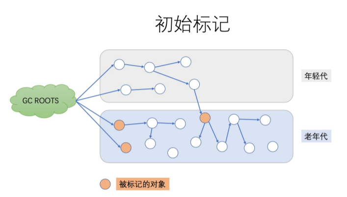
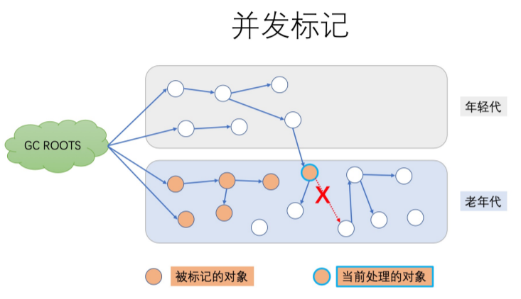
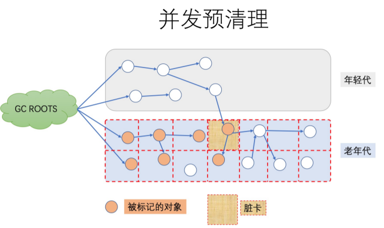
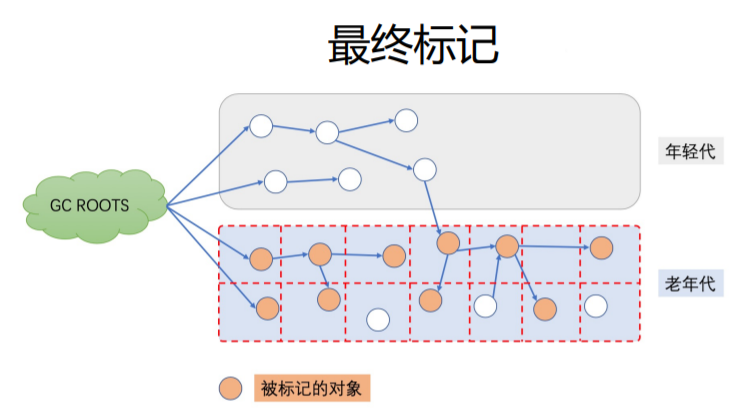
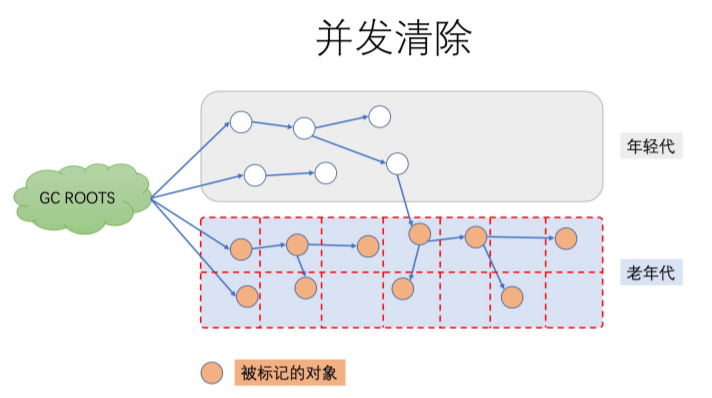
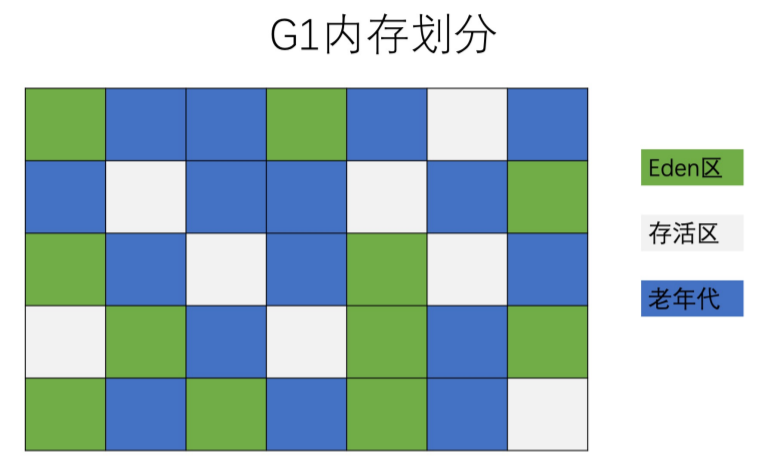
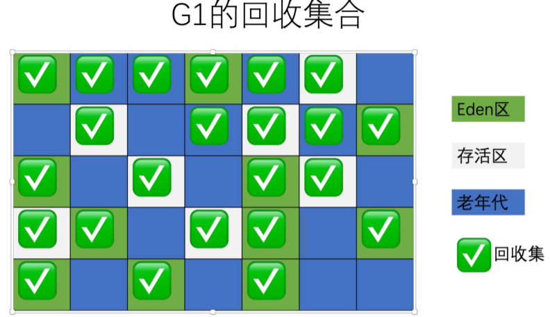
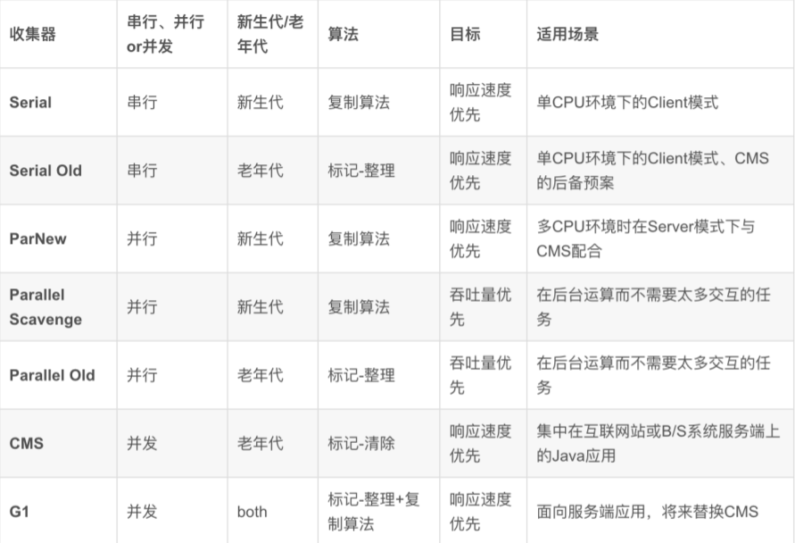
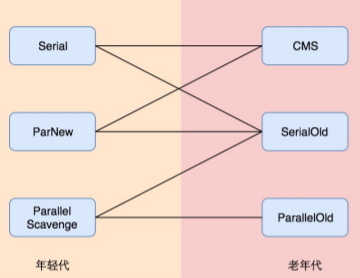

## 串行 GC（Serial GC）

```sh
-XX：+UseSerialGC 配置串行 GC
```

### 介绍

串行 GC 对年轻代使用 mark-copy（标记-复制） 算法，对老年代使用 mark-sweep-compact （标记-清除-整理）算法

两者都是单线程的垃圾收集器，不能进行并行处理，所以都会触发全线暂停（**STW**），停止所有的应用线程

因此这种 GC 算法不能充分利用多核 CPU。不管有多少CPU 内核，JVM 在垃圾收集时都只能使用单个核心

### 特点

CPU 利用率高，暂停时间长。简单粗暴，就像老式的电脑，动不动就卡死

### 适用场景

该选项只适合几百 MB 堆内存的 JVM，而且是单核 CPU 时比较有用

## 并行 GC（Parallel GC）

```sh
-XX：+UseParallelGC
-XX：+UseParallelOldGC
-XX：+UseParallelGC -XX:+UseParallelOldGC
-XX：ParallelGCThreads=N //来指定 GC 线程数， 其默认值为 CPU 核心数
```

年轻代和老年代的垃圾回收都会触发 STW 事件

在年轻代使用 标记-复制（mark-copy）算法，在老年代使用 标记-清除-整理（mark-sweepcompact）算法

### 适用场景

并行垃圾收集器适用于多核服务器，主要目标是增加吞吐量。因为对系统资源的有效使用，能达到更高的吞吐量:

* 在 GC 期间，所有 CPU 内核都在并行清理垃圾，所以总暂停时间更短；

* 在两次 GC 周期的间隔期，没有 GC 线程在运行，不会消耗任何系统资源

## CMS

```sh
-XX：+UseConcMarkSweepGC
```

其对年轻代采用并行 STW 方式的 mark-copy (标记-复制)算法，对老年代主要使用并发 marksweep (标记-清除)算法

CMS GC 的设计目标是避免在老年代垃圾收集时出现长时间的卡顿，主要通过两种手段来达成此 目标

1. 不对老年代进行整理，而是使用空闲列表（free-lists）来管理内存空间的回收

2. 在 mark-and-sweep （标记-清除） 阶段的大部分工作和应用线程一起并发执行

也就是说，在这些阶段并没有明显的应用线程暂停。但值得注意的是，它仍然和应用线程争抢 CPU 时间。默认情况下，CMS 使用的并发线程数等于 CPU 核心数的 1/4。

### 适用场景

如果服务器是多核 CPU，并且主要调优目标是降低 GC 停顿导致的系统延迟，那么使用 CMS 是 个很明智的选择。进行老年代的并发回收时，可能会伴随着多次年轻代的 minor GC。

### 6个阶段

* 阶段 1: Initial Mark（初始标记）

* 阶段 2: Concurrent Mark（并发标记）

* 阶段 3: Concurrent Preclean（并发预清理） 

* 阶段 4: Final Remark（最终标记） 

* 阶段 5: Concurrent Sweep（并发清除） 

* 阶段 6: Concurrent Reset（并发重置）



这个阶段伴随着 STW 暂停。初始标记的目标是标记所有的根对象，包括根对象直接引用的对象，以及被年轻代中 所有存活对象所引用的对象（老年代单独回收）



在此阶段，CMS GC遍历老年代，标记所有的存活对象，从前一阶段 “Initial Mark” 找到的根对象开始算起。 “并发标记”阶段，就是与应用程序同时运行，不用暂停的阶段



此阶段同样是与应用线程并发执行的，不需要停止应用线 程。 因为前一阶段【并发标记】与程序并发运行，可能 有一些引用关系已经发生了改变。如果在并发标记过程中 引用关系发生了变化，JVM 会通过“Card（卡片）”的方 式将发生了改变的区域标记为“脏”区，这就是所谓的 卡片 标记（Card Marking）。



最终标记阶段是此次 GC 事件中的第二次（也是最后一 次）STW 停顿。本阶段的目标是完成老年代中所有存活 对象的标记. 因为之前的预清理阶段是并发执行的，有可 能 GC 线程跟不上应用程序的修改速度。所以需要一次 STW 暂停来处理各种复杂的情况。 通常 CMS 会尝试在年轻代尽可能空的情况下执行 Final Remark 阶段，以免连续触发多次 STW 事件



此阶段与应用程序并发执行，不需要 STW 停顿。JVM 在此 阶段删除不再使用的对象，并回收他们占用的内存空间

阶段 6

Concurrent Reset（并发重置） 此阶段与应用程序并发执行，重置 CMS 算法相关的内部 数据，为下一次 GC 循环做准备

### 被废弃

在 JDK 9 中被废弃了。根据 JEP-291中的说明，为了减轻 GC 代码的维护负担以及加速新功能开发，决定在 JDK9 中废弃CMS GC

## G1

```sh
-XX：+UseG1GC -XX:MaxGCPauseMillis=50
```

G1 的全称是 Garbage -First，意为垃圾优先，哪一块的垃圾最多就优先清理它。JDK 9 默认GC

G1 GC 最主要的设计目标是：将 STW 停顿的时间和分布，变成可预期且可配置的

堆不再分成年轻代和老年代，而是划分为多 个（通常是 2048 个）可以存放对象的 小块堆区域 (smaller heap regions)。每个小块，可能一会被定义成 Eden 区，一会被指定为Survivor区或者 Old 区。在逻辑上，所有的 Eden 区和 Survivor 区合起来就是年轻代，所有的 Old 区拼在一起那就是老年代



这样划分之后，使得 G1 不必每次都去收集整 个堆空间，而是以增量的方式来进行处理: 每 次只处理一部分内存块，称为此次 GC 的回收 集(collection set)。每次 GC 暂停都会收集所有年轻代的内存块，但一般只包含部分老年代的内存块



### 参数配置

```sh
-XX：+UseG1GC：启用 G1 GC；
-XX：G1NewSizePercent：初始年轻代占整个 Java Heap 的大小，默认值为 5%；
-XX：G1MaxNewSizePercent：最大年轻代占整个 Java Heap 的大小，默认值为 60%；
-XX：G1HeapRegionSize：设置每个 Region 的大小，单位 MB，需要为 1，2，4，8，16，32 中的某个值，默认是堆内存的 1/2000。如果这个值设置比较大，那么大对象就可以进入 Region 了。
-XX：ConcGCThreads：与 Java 应用一起执行的 GC 线程数量，默认是 Java 线程的 1/4，减少这个参数的数值可能会提升并行回收的效率，提高系统内部吞吐量。如果这个数值过低，参与回收垃圾的线程不足，也会导致并行回收机制耗时加长。
-XX：+InitiatingHeapOccupancyPercent（简称 IHOP）：G1 内部并行回收循环启动的阈值，默认为 Java Heap 的 45%。这个可以理解为老年代使用大于等于 45% 的时候，JVM 会启动垃圾回收。这个值非常重要，它决定了在什么时间启动老年代的并行回收。
-XX：G1HeapWastePercent：G1停止回收的最小内存大小，默认是堆大小的 5%。GC 会收集所有的 Region 中的对象，但是如果下降到了 5%，就会停下来不再收集了。就是说，不必每次回收就把所有的垃圾都处理完，可以遗留少量的下次处理，这样也降低了单次消耗的时间。
-XX：G1MixedGCCountTarget：设置并行循环之后需要有多少个混合 GC 启动，默认值是 8 个。老年代 Regions 的回收时间通常比年轻代的收集时间要长一些。所以如果混合收集器比较多，可以允许 G1 延长老年代的收集时间。
-XX：+G1PrintRegionLivenessInfo：这个参数需要和 -XX:+UnlockDiagnosticVMOptions 配合启动，打印 JVM 的调试信
息，每个 Region 里的对象存活信息。
-XX：G1ReservePercent：G1 为了保留一些空间用于年代之间的提升，默认值是堆空间的 10%。因为大量执行回收的地方在
年轻代（存活时间较短），所以如果你的应用里面有比较大的堆内存空间、比较多的大对象存活，这里需要保留一些内存。
-XX：+G1SummarizeRSetStats：这也是一个 VM 的调试信息。如果启用，会在 VM 退出的时候打印出 Rsets 的详细总结信
息。如果启用 -XX:G1SummaryRSetStatsPeriod 参数，就会阶段性地打印 Rsets 信息。
-XX：+G1TraceConcRefinement：这个也是一个 VM 的调试信息，如果启用，并行回收阶段的日志就会被详细打印出来。
-XX：+GCTimeRatio：这个参数就是计算花在 Java 应用线程上和花在 GC 线程上的时间比率，默认是 9，跟新生代内存的分
配比例一致。这个参数主要的目的是让用户可以控制花在应用上的时间，G1 的计算公式是 100/（1+GCTimeRatio）。这样
如果参数设置为 9，则最多 10% 的时间会花在 GC 工作上面。Parallel GC 的默认值是 99，表示 1% 的时间被用在 GC 上面，
这是因为 Parallel GC 贯穿整个 GC，而 G1 则根据 Region 来进行划分，不需要全局性扫描整个内存堆。
-XX：+UseStringDeduplication：手动开启 Java String 对象的去重工作，这个是 JDK8u20 版本之后新增的参数，主要用于
相同 String 避免重复申请内存，节约 Region 的使用。
-XX：MaxGCPauseMills：预期 G1 每次执行 GC 操作的暂停时间，单位是毫秒，默认值是 200 毫秒，G1 会尽量保证控制在
这个范围内。
```

### 处理步骤

#### 年轻代模式转移暂停（Evacuation Pause）

G1 GC 会通过前面一段时间的运行情况来不断的调整自己的回收策略和行为，以此来比较稳定地控制暂停时间。在应用程序刚启动时，G1 还没有采集到什么足够的信息，这时候就处于初始的 fullyyoung 模式。当年轻代空间用满后，应用线程会被暂停，年轻代内存块中的存活对象被拷贝到存活区。如果还没有存活区，则任意选择一部分空闲的内存块作为存活区。 拷贝的过程称为转移（Evacuation)，这和前面介绍的其他年轻代收集器是一样的工作原理

#### 并发标记（Concurrent Marking）

同时我们也可以看到，G1 GC 的很多概念建立在 CMS 的基础上，所以下面的内容需要对 CMS 有一定的理解

G1 并发标记的过程与 CMS 基本上是一样的。G1 的并发标记通过 Snapshot-At-The-Beginning（起始 快照）的方式，在标记阶段开始时记下所有的存活对象。即使在标记的同时又有一些变成了垃圾。通过对象的存活信息，可以构建出每个小堆块的存活状态，以便回收集能高效地进行选择。

这些信息在接下来的阶段会用来执行老年代区域的垃圾收集。 

有两种情况是可以完全并发执行的：

* 如果在标记阶段确定某个小堆块中没有存活对象，只包含垃圾； 

* 在 STW 转移暂停期间，同时包含垃圾和存活对象的老年代小堆块。 当堆内存的总体使用比例达到一定数值，就会触发并发标记。这个默认比例是 45%，但也可以通过 JVM 参数 InitiatingHeapOccupancyPercent 来设置。和 CMS 一样，G1 的并发标记也是由多个阶段组成， 其中一些阶段是完全并发的，还有一些阶段则会暂停应用线程

##### 阶段

阶段 1: Initial Mark（初始标记） 此阶段标记所有从 GC 根对象直接可达的对象。

阶段 2: Root Region Scan（Root区扫描） 此阶段标记所有从 "根区域" 可达的存活对象。根区域包括：非空的区域，以及在标记过程中不得不收集的区域。 

阶段 3: Concurrent Mark（并发标记） 此阶段和 CMS 的并发标记阶段非常类似：只遍历对象图，并在一个特殊的位图中标记能访问到的对象。 

阶段 4: Remark（再次标记） 和 CMS 类似，这是一次 STW 停顿(因为不是并发的阶段)，以完成标记过程。 G1 收集器会短暂地停止应用线程， 停止并发更新信息的写入，处理其中的少量信息，并标记所有在并发标记开始时未被标记的存活对象。 

阶段 5: Cleanup（清理） 最后这个清理阶段为即将到来的转移阶段做准备，统计小堆块中所有存活的对象，并将小堆块进行排序，以提升 GC 的效率，维护并发标记的内部状态。 所有不包含存活对象的小堆块在此阶段都被回收了。有一部分任务是并发 的：例如空堆区的回收，还有大部分的存活率计算。此阶段也需要一个短暂的 STW 暂停。

#### 转移暂停: 混合模式（Evacuation Pause (mixed)）

并发标记完成之后，G1将执行一次混合收集（mixed collection），就是不只清理年轻代，还将一部 分老年代区域也加入到 回收集 中。混合模式的转移暂停不一定紧跟并发标记阶段。有很多规则和历 史数据会影响混合模式的启动时机。比如，假若在老年代中可以并发地腾出很多的小堆块，就没有必 要启动混合模式

因此，在并发标记与混合转移暂停之间，很可能会存在多次 young 模式的转移暂停。 

具体添加到回收集的老年代小堆块的大小及顺序，也是基于许多规则来判定的。其中包括指定的软实 时性能指标，存活性，以及在并发标记期间收集的 GC 效率等数据，外加一些可配置的 JVM 选项。混 合收集的过程，很大程度上和前面的 fully-young gc 是一样的

### 注意事项

特别需要注意的是，某些情况下 G1 触发了 Full GC，这时 G1 会退化使用 Serial 收集器来完成垃圾的清理工作， 它仅仅使用单线程来完成 GC 工作，GC 暂停时间将达到秒级别的

1. 并发模式失败

G1 启动标记周期，但在 Mix GC 之前，老年代就被填满，这时候 G1 会放弃标记周期。

> 解决办法：
>
> 增加堆大小， 或者调整周期（例如增加线程数-XX：ConcGCThreads 等）

2. 晋升失败

没有足够的内存供存活对象或晋升对象使用，由此触发了 Full GC(to-space exhausted/to-space overflow）

>  解决办法：
>
> a) 增加 –XX：G1ReservePercent 选项的值（并相应增加总的堆大小）增加预留内存量。 
>
> b) 通过减少 –XX：InitiatingHeapOccupancyPercent 提前启动标记周期。
>
> c) 也可以通过增加 –XX：ConcGCThreads 选项的值来增加并行标记线程的数目

3. 巨型对象分配失败 

当巨型对象找不到合适的空间进行分配时，就会启动 Full GC，来释放空间。

> 解决办法：
>
> 增加内存或者增大 -XX：G1HeapRegionSize

## ZGC

```sh
-XX：+UnlockExperimentalVMOptions -XX:+UseZGC -Xmx16g
```

### 特点

1. GC 最大停顿时间不超过 10ms
2. 堆内存支持范围广，小至几百 MB 的堆空间，大至 4TB 的超大堆 内存（JDK13 升至 16TB）
3. 与 G1 相比，应用吞吐量下降不超过 15%
4. 当前只支持 Linux/x64 位平台，JDK15 后支持 MacOS 和 Windows 系统

## 各GC对比



## 常用GC组合



1. Serial + Serial Old 实现单线程的低延迟 垃圾回收机制
2. ParNew + CMS，实现多线程的低延迟垃 圾回收机制
3. Parallel Scavenge和Parallel Scavenge Old，实现多线程的高吞吐量垃圾回收机制

## GC如何选择

选择正确的 GC 算法，唯一可行的方式就是去尝试，一般性的指导原则：

1. 如果系统考虑吞吐优先，CPU 资源都用来最大程度处理业务，用 Parallel GC；
2. 如果系统考虑低延迟有限，每次 GC 时间尽量短，用 CMS GC；
3. 如果系统内存堆较大，同时希望整体来看平均 GC 时间可控，使用 G1 GC

对于内存大小的考量

1. 一般 4G 以上，算是比较大，用 G1 的性价比较高
2. 一般超过 8G，比如 16G-64G 内存，非常推荐使用 G1 GC

## GC 算法和实现的演进路线

1. 串行 -> 并行: 重复利用多核 CPU 的优势，大幅降低 GC 暂停时间，提升吞吐量。
2. 并行 -> 并发： 不只开多个 GC 线程并行回收，还将GC操作拆分为多个步骤，让很多繁重的任务和应用线程一起并 发执行，减少了单次 GC 暂停持续的时间，这能有效降低业务系统的延迟
3. CMS -> G1： G1 可以说是在 CMS 基础上进行迭代和优化开发出来的，划分为多个小堆块进行增量回收，这样就更进一步地降低了单次 GC 暂停的时间
4. G1 -> ZGC:：ZGC 号称无停顿垃圾收集器，这又是一次极大的改进。ZGC 和 G1 有一些相似的地方，但是底层的算法和思想又有了全新的突破

目前绝大部分 Java 应用系统，堆内存并不大比如 2G-4G 以内，而且对 10ms 这种低延迟的 GC 暂停不敏感，也就是说处 理一个业务步骤，大概几百毫秒都是可以接受的，GC 暂停 100ms 还是 10ms 没多大区别。另一方面，系统的吞吐量反 而往往是我们追求的重点，这时候就需要考虑采用并行 GC

如果堆内存再大一些，可以考虑 G1 GC。如果内存非常大（比如超过 16G，甚至是 64G、128G），或者是对延迟非常 敏感（比如高频量化交易系统），就需要考虑使用本节提到的新 GC（ZGC/Shenandoah）

## GC总结

1. 串行 GC（Serial GC）: 单线程执行，应用需要暂停； 
2. 并行 GC（ParNew、Parallel Scavenge、Parallel Old）: 多线程并行地执行垃圾回收， 关注与高吞吐； 
3. CMS（Concurrent Mark-Sweep）: 多线程并发标记和清除，关注与降低延迟； 
4. G1（G First）: 通过划分多个内存区域做增量整理和回收，进一步降低延迟； 
5. ZGC（Z Garbage Collector）: 通过着色指针和读屏障，实现几乎全部的并发执行，几毫 秒级别的延迟，线性可扩展； 
6. Epsilon: 实验性的 GC，供性能分析使用； 
7. Shenandoah: G1 的改进版本，跟 ZGC 类似

