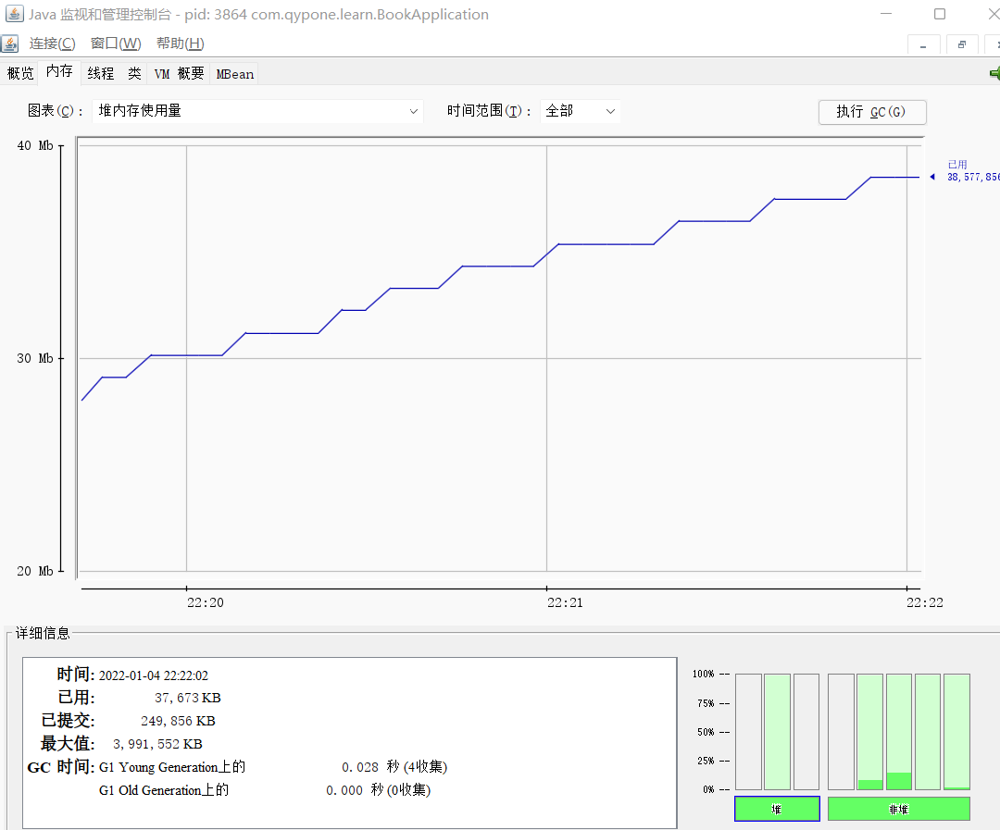
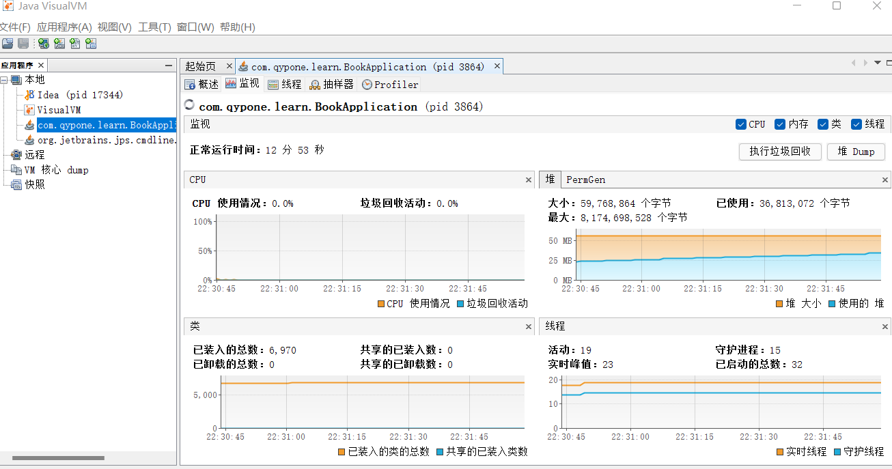
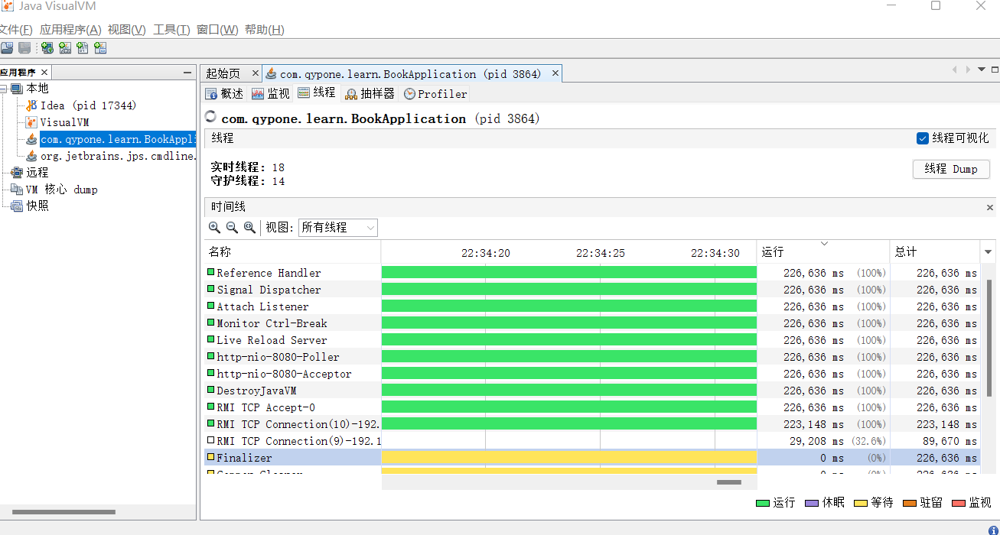
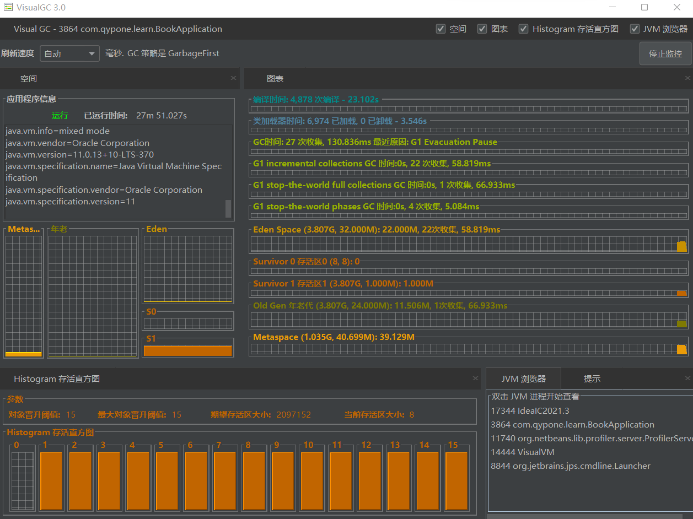

## jconsole

查看内存、线程、类、jvm相关信息

可以直接执行GC

## jvisualvm

可以dump堆

可以查看线程的状态变化，运行时长，当运行时间比较久，那么可以来排查是否出现问题

抽样器：可以观察一定时间内系统运行的情况，包括CPU和内存使用情况，jconsole只有历史趋势和当前时间点的状况

## VisualGC

插件，idea或eclipse可以安装，图形化展示

## jmc

检测死锁、对象创建速度

飞行记录器：一段时间内jvm情况，存成文件
