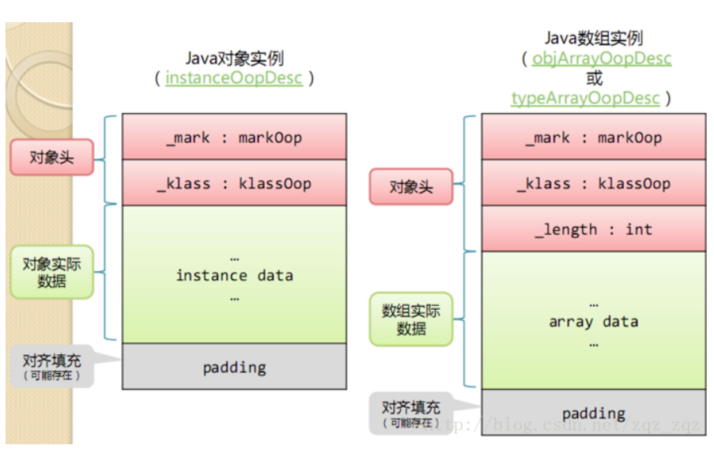
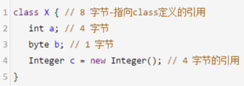

## 内存结构

在HotSpot虚拟机中，对象在内存中存储的布局可以分为3块区域：**对象头（Header)**、**实例数据（Instance Data）**和**对齐填充（Padding）**

### 对象头

1. markword
   用于存储对象自身的运行时数据，如哈希码（HashCode）、GC分代年龄、锁状态标志、线程持有的锁、偏向线程ID、偏向时间戳等，这部分数据的长度在32位和64位的虚拟机（未开启压缩指     针）中分别为32bit和64bit，官方称它为“MarkWord”。
2. klass
   klass类型指针，即对象指向它的类元数据的指针，虚拟机通过这个指针来确定这个对象是哪个类的实例.
3. 数组长度（只有数组对象有）
   如果对象是一个数组，那在对象头中还必须有一块数据用于记录数组长度

### 实例数据
实例数据部分是对象真正存储的有效信息，也是在程序代码中所定义的各种类型的字段内容。无论是从父类继承下来的，还是在子类中定义的，都需要记录起来。

### 对齐填充
对齐填充并不是必然存在的，也没有特别的含义，它仅仅起着占位符的作用。由于HotSpot VM的自动内存管理系统要求对象起始地址必须是8字节的整数倍，换句话说，就是对象的大小必须是8字节的整数倍。而对象头部分正好是8字节的倍数（1倍或者2倍），因此，当对象实例数据部分没有对齐时，就需要通过对齐填充来补全。

### 一个 Java 对象占用多少内存

> 可以使用 Instrumentation.getObjectSize() 
>
> 方法来估算一个对象占用的内存空间。
>
> JOL (Java Object Layout) 可以用来查看对象内存布局

## 内存分析

#### 对象头和对象引用

在64位 JVM 中，对象头占据的空间是 12-byte(=96bit=64+32)，但是以8字节对齐，所以一个空类的实例至少占用16字节

在32位 JVM 中，对象头占8个字节，以4的倍数对齐(32=4*8)

所以 new 出来很多简单对象，甚至是 new Object()，都会占用不少内容哈

通常在32位 JVM，以及内存小于 -Xmx32G 的64位JVM 上(默认开启指针压缩)，一个引用占的内存默认是4个字节。

因此，64位 JVM 一般需要多消耗堆内存

#### 包装类型

比原生数据类型消耗的内存要多： 

* Integer：占用16字节(8+4=12+补齐)，因为 int 部分 占4个字节。 所以使用 Integer 比原生类型 int 要多消耗 300% 的内存。 

* Long：一般占用16个字节(8+8=16)，当然，对象的实际大小由底层平台的内存对齐确定，具体由特定 CPU 平台的 JVM 实现决定。看起来一个 Long 类型的对 象，比起原生类型 long 多占用了8个字节（也多消耗 了100%）

* 多维数组：在二维数组int【dim1】【dim2】中，每个嵌套的数组 int[dim2] 都是一个单独的 Object，会额外占用16字节的空间。当数组维度更大时，这种开销特别明显。

  > int【128】【2】 实例占用3600字节。 而 int[256] 实例则只占用1040字节，里面的有效存储空间是一样的，3600 比起1040多了246%的额外开销。在极端情况下，byte【256】【1】，额外开销的比例是19倍! 

* String：String 对象的空间随着内部字符数组的增长而增长。当然，String 类的对象有24个字节的额外开销。对于10字符以内的非空 String，增加的开销比起有效载荷（每个字符2字节 + 4 个字节的 length）， 多占用了100% 到 400% 的内存。

#### 案例

对齐是绕不过去的问题

我们可能会认为，一个 X 类的实例占用17字节的空间。 但是由于需要对齐(padding)，JVM 分配的内存是8字节的整数倍，所以占用的空间不是17字节，而是24字节

## OOM

### OutOfMemoryError: Java heap space

* 现象：创建新的对象时，堆内存中的空间不足以存放新创建的对象

* 产生原因
  * 很多时候就类似于将 XXL 号的对象，往 S 号的 Java heap space 里面塞。其实清楚了原因，问题就很容易解决了：只要增加堆内存的大小，程序就能正常运行
  * 代码问题导致的：
    * 超出预期的访问量/数据量：应用系统设计时，一般是有 “容量” 定义的，部署这么多机器，用来处理一定流量的数据/业务。如果访问量突然飙升，超过预期的阈值，类似于时间坐标系中针尖形状的图谱。那么在峰值所在的时间段，程序很可能就会卡死、并触发 java.lang.OutOfMemoryError: Java heap space错误
    * 内存泄露(Memory leak)：这也是一种经常出现的情形。由于代码中的某些隐蔽错误，导致系统占用的内存越来越多。如果某个方法/某段代码存在内存泄漏，每执行一次，就会（有更多的垃圾对 象）占用更多的内存。随着运行时间的推移，泄漏的对象耗光了堆中的所有内存，那么 java.lang.OutOfMemoryError: Java heap space 错误就爆发了。

#### OutOfMemoryError: PermGen space/OutOfMemoryError: Metaspace

* 产生原因：是加载到内存中的 class 数量太多或体积太大，超过了 PermGen 区的大小。

* 解决办法：增大 PermGen/Metaspace

  -XX:MaxPermSize=512m

  -XX:MaxMetaspaceSize=512m

高版本 JVM 也可以： -XX:+CMSClassUnloadingEnabled

#### OutOfMemoryError: Unable to create new native thread

* 产生原因：程序创建的线程数量已达到上限值的异常信息
* 解决思路： 
  * 调整系统参数 ulimit -a，echo 120000 > /proc/sys/kernel/threads-max 
  * 降低 xss 等参数 
  * 调整代码，改变线程创建和使用方式

## 好文

着重看下第一、第二篇文章，最后一篇文章包含**HotSpot对象模型（OOP-Klass模型）**

[深入理解Instrument]: https://www.jianshu.com/p/5c62b71fd882	"深入理解Instrument"
[一个Java对象占多少内存？]: https://cloud.tencent.com/developer/article/1596672	"一个Java对象占多少内存？"
[一个java对象到底占用多大内存]: https://www.cnblogs.com/zhanjindong/p/3757767.html	"一个java对象到底占用多大内存"
[一个对象占用多少字节]: https://www.iteye.com/blog/yueyemaitian-2033046	"一个对象占用多少字节"
[java对象结构]: https://blog.csdn.net/zqz_zqz/article/details/70246212	"java对象结构"

本文中部分转载自以上文章，感谢各位大佬的知识传递

