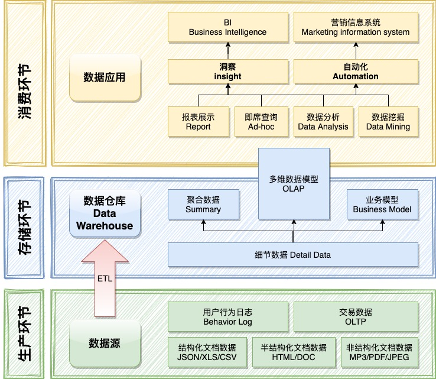

> [构建BI：大数据系统概念 | ZRONG's BLOG (zengrong.net)](https://blog.zengrong.net/post/build-bi-1/)

BI 系统，在商业上属于 DDS（Decision support system，决策支持系统)，作用是将源数据整理到数据仓库(Data Warehouse) 中，然后根据业务模型对仓库中的数据进行分析、聚合，最终在数据应用层面展示出来。

### 源数据

在数据生产环节，源数据可能有多种来源，例如来自于 OLTP 的交易数据和行为数据，来自于文档的结构化数据，和来自于图像、声音等非结构化数据。

### 数据仓库

数据仓库（Data Warehouse）处于存储环节。我们根据业务模型对数据源中的数据进行抽取、清洗、转换、聚合，将处理过的源数据存储进入数据仓库备用。整个处理的过程被称为 ETL。

### 数据应用

BI 属于一种洞察应用。