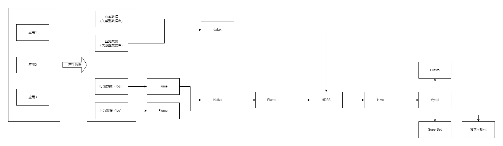
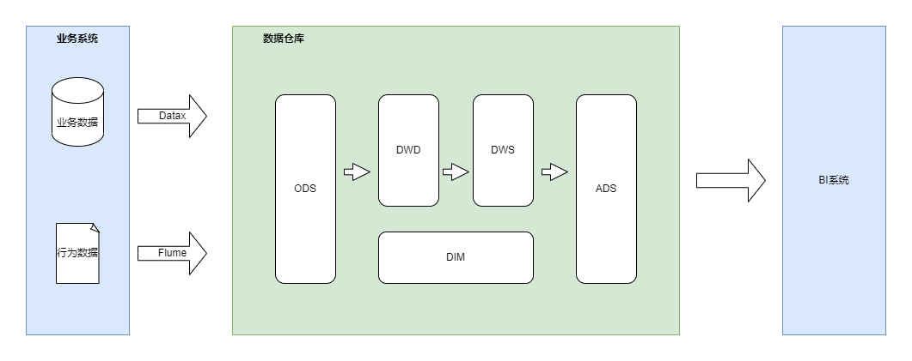

# 实施路径

1. 用户行为、业务等数据采集平台搭建
   * k8s安装环境准备
   * 软件安装：flume、datax、kafka、zookeeper、hadoop等
   * 联调各组件连通性，调整各组件配置
   * 选取一个涉及日志相关指标，应用日志埋点，埋点数据采集联调，调整各组件配置，flume监控调整
   * 选取一个涉及业务数据相关指标，应用业务数据同步联调，datax配置编写
2. 数据仓库维度建模与搭建
   * 明确指标需求
   * 分析指标需求，定义事实表、维度表
   * 制定各表同步策略
   * 安装Dolphin Scheduler，编写调度脚本
   * ODS、DWD、DWS、DIM、ADS各层脚本编写
   * 整体联调数据采集与数仓各层数据调度执行
3. 分析核心指标，完成报表、BI等可视化展示
   * BI系统选型与搭建
   * BI系统接入数仓（hive或者mysql）
   * 数据采集、数仓数据处理、BI系统整体联调
4. 增强功能：实时指标分析、集群性能监控、异常报警、元数据管理、质量监控--暂可不做

# 技术选型

* 数据采集：Flume，DataX，Kafka
* 数据存储：HDFS，Mysql
* 数据计算：Hive，Spark
* 数据查询：Presto，Kylin，Druid
* 数据可视化：SuperSet（免费），QuickBI，DataV
* 任务调度：azkaban，Dolphin Scheduler，Oozie
* 集群监控：Zabbix
* 元数据管理：Atlas

## 各组件版本推荐
| 组件   |      版本      |  备注 |
|----------|-------------|------|
| java |  1.8 |hadoop需要 |
| hadoop |  3.x     |  |
| hive | 3.x |参考hadoop版本  |
| flume |  |  |
| kafka |  |  |
| datax |  |  |
| zookeeper |  |  |

## 服务器

参考因素：每日产生的日志量大小、是否采用数据压缩、是否采用数据分层
* 磁盘要求：xx
* 内存要求：xx

## 简单部署规划

参考文档：简单部署规划.xlsx

# 数据采集

* 数据分类：业务数据、行为数据（日志）
* 主要方式：埋点
* 核心框架图

## 行为数据埋点方式

1. 比较以下两种实现方式
   * logback直接输出到flume
   * logback生成日志文件后，flume监控日志文件变化同步
2. 代码埋点方式
   * 前端埋点：js埋点，前端埋点能够收集更全面、精细的用户数据
   * 后端埋点：AOP，代码编写

## 前置Fulme

将日志数据传输到Kafka

### 使用TaildirSource 和 KafkaChannel
1. TailDirSource相比ExecSource、SpoolingDirectorySource的优势
   * TailDirSource：断点续传、多目录。Flume1.6以前需要自己自定义Source记录每次读取文件位置，实现断点续传。
   * ExecSource可以实时搜集数据，但是在Flume不运行或者Shell命令出错的情况下，数据将会丢失。
   * SpoolingDirectorySource监控目录，支持断点续传
2. KafkaChannel
  省去Sink，提高效率

### 配置

1. TaildirSource
   * 配置采集的日志文件（正则匹配）
   * 非法数据过滤，需要自定义，即编写代码
2. KafkaChannel
   * 指定kafa的topic 

## 后置Flume
将Kafka数据传输到HDFS
> 使用KafkaSource 和 HDFSSink

### 配置
1. KafkaSource
  * 订阅kafka的topic
2. HDFSSink
  * 考虑数据分隔，比如按天分隔

## 采集业务数据

### 采集方式

* 全量采集：每天都将业务数据库中的全部数据同步一份到数据仓库
* 增量采集：每天只将业务数据中的新增及变化数据同步到数据仓库

比较
| 方式   |      优点      |  缺点 |
|----------|-------------|------|
| 全量 |  采集逻辑简单 |同步重复数据，不适用于数据量大但变化少的表 |
| 增量 |  效率高，无需同步和存储重复数据 | 逻辑复杂，需识别新增和变化的数据 |

### 数据同步组件

* 基于Select查询的离线、批量同步工具：DataX、Sqoop
* 基于数据库数据变更日志的实时流式同步工具：Maxwell、Canal

### DataX

* 如何配置
* 考虑各个表的同步策略
* 多种数据源配置

#### 读Oracle，写HDFS

* OracleReader + HdfsWriter，需要编写datax脚本

# 数据仓库

* 任务：对数据清洗、转义、分类、重组、合并、拆分、统计
* 分类：离线数仓（批处理），实时数仓（流处理）
* Hive 做数仓主体，数据存储、管理、分析
* 任务调度：azkaban、Dolphin Scheduler
* 核心框架图

## 数据建模

数据模型就是数据组织和存储方法，它强调从业务、数据存取和使用角度合理存储数据

### 维度模型方法

* 事实表
* 维度表

## Hive

* hive on spark（首选）
* spark on hive
* hive on tze
  
## Yarn
todo ...

## 数据分层
以下为标准分层，可定制，并不一定按照此分层来做

### ODS-原始数据层
存放未经处理过的原始数据，结构上与源系统保持一致，是数据仓库的准备区
* ODS层的表结构设计依托于从业务系统同步过来的数据结构。
* ODS层要保存全部历史数据，故其压缩格式应选择压缩比较高的，此处选择gzip。
* ODS层表名的命名规范为：ods_表名_单分区增量全量标识（inc/full）

### DIM-维度表层
基于维度建模理论进行构建，存放维度模型中的维度表，保存一致性维度信息
* DIM层的设计依据是维度建模理论，该层存储维度模型的维度表。
* DIM层的数据存储格式为orc列式存储+snappy压缩。
* DIM层表名的命名规范为dim_表名_全量表或者拉链表标识（full/zip）

### DWD-数据明细层
基于维度建模理论进行构建，存放维度模型中的事实表，保存各业务过程最小粒度的操作记录
* DWD层的设计依据是维度建模理论，该层存储维度模型的事实表。
* DWD层的数据存储格式为orc列式存储+snappy压缩。
* DWD层表名的命名规范为dwd_数据域_表名_单分区增量全量标识（inc/full）

### DWS-汇总数据层
基于上层的指标要求，以分析的主题对象为建模驱动，构建公共统计粒度的汇总表
* DWS层的设计参考指标体系。
* DWS层的数据存储格式为orc列式存储+snappy压缩。
* DWS层表名的命名规范为dws_数据域_统计粒度_业务过程_统计周期（1d/nd/td）

例：用户订单最近一日汇总表

### ADS-数据服务层/应用层
存放各项统计指标结果
例：用户留存率

## 报表数据导出
为方便报表应用使用数据，需将ads各指标的统计结果导出到MySQL或其它数据库中

### datax
HDFSReader 和 MySQLWriter

## 工作流调度

DolphinScheduler  或者  azkaban

# 可视化展示

* 报表
* 用户画像
* 推荐系统
* 风控

## Superset
### 简介
Apache Superset是一个现代的数据探索和可视化平台。它功能强大且十分易用，可对接各种数据源，包括很多现代的大数据分析引擎，拥有丰富的图表展示形式，并且支持自定义仪表盘

### 连接数据源
> 官方文档：https://superset.apache.org/docs

1. 连接hive
2. 连接mysql

## 其它系统
建设bi系统
