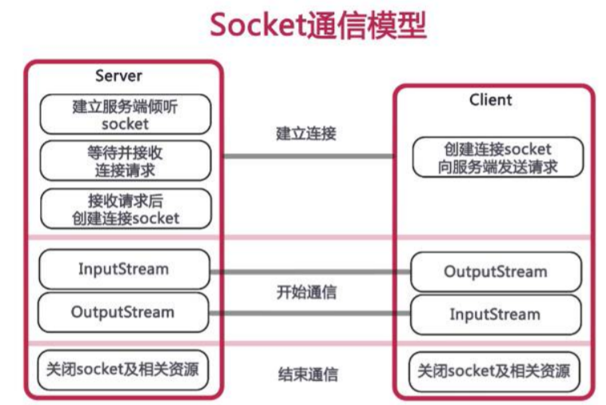
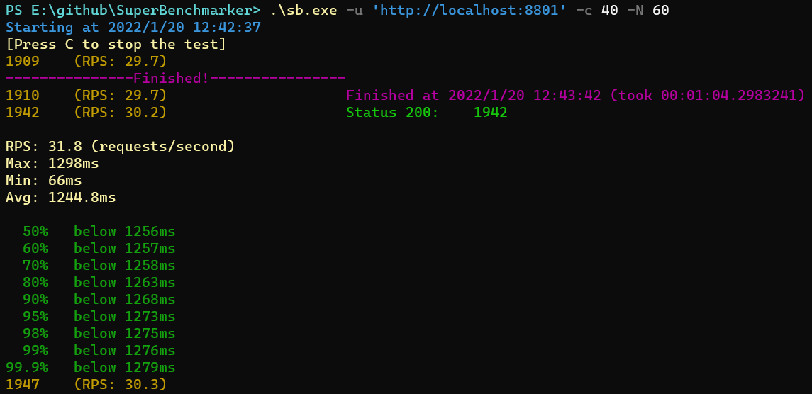
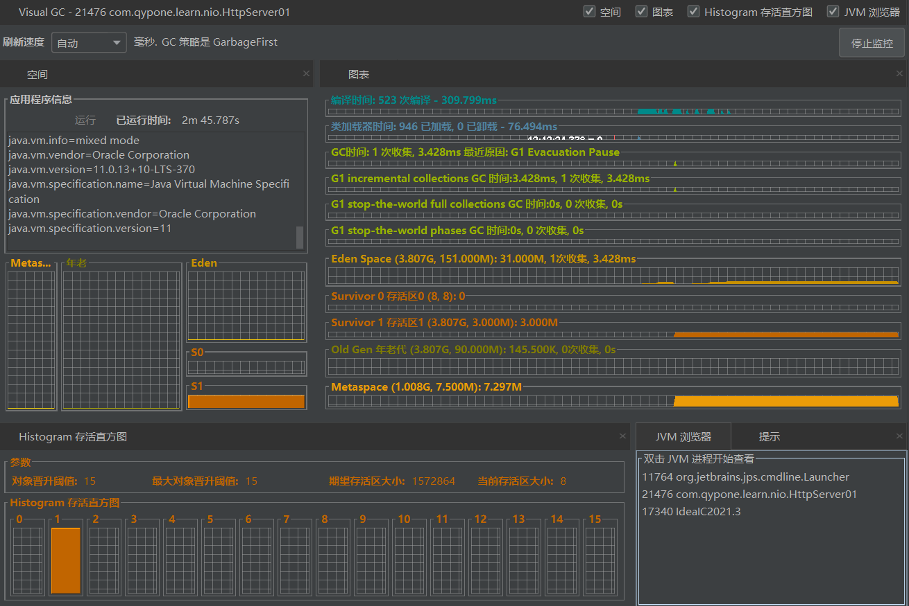
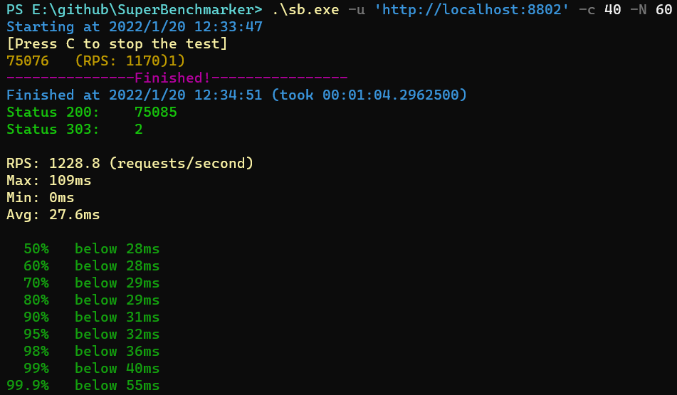
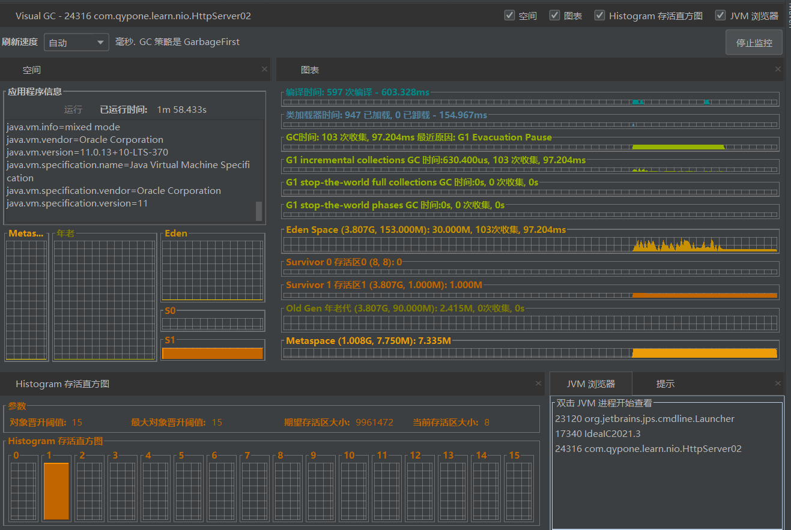
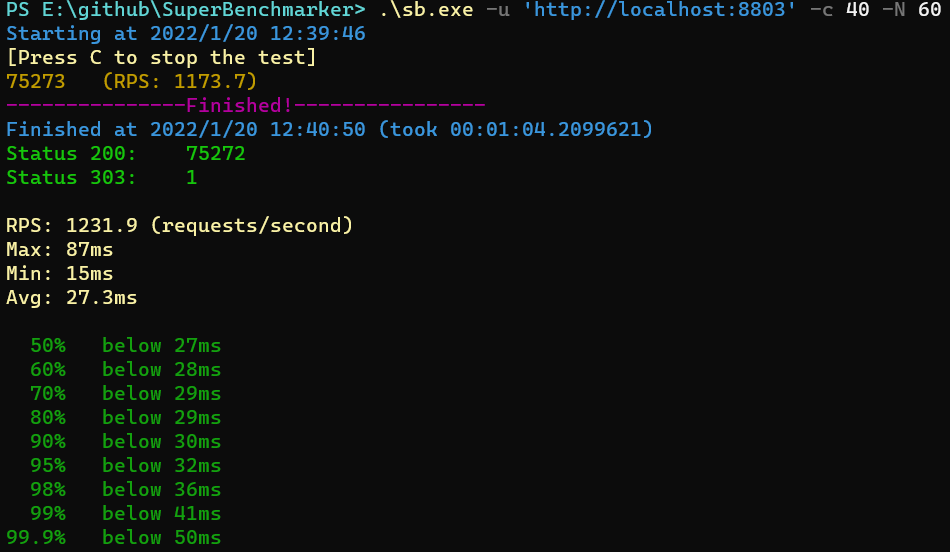
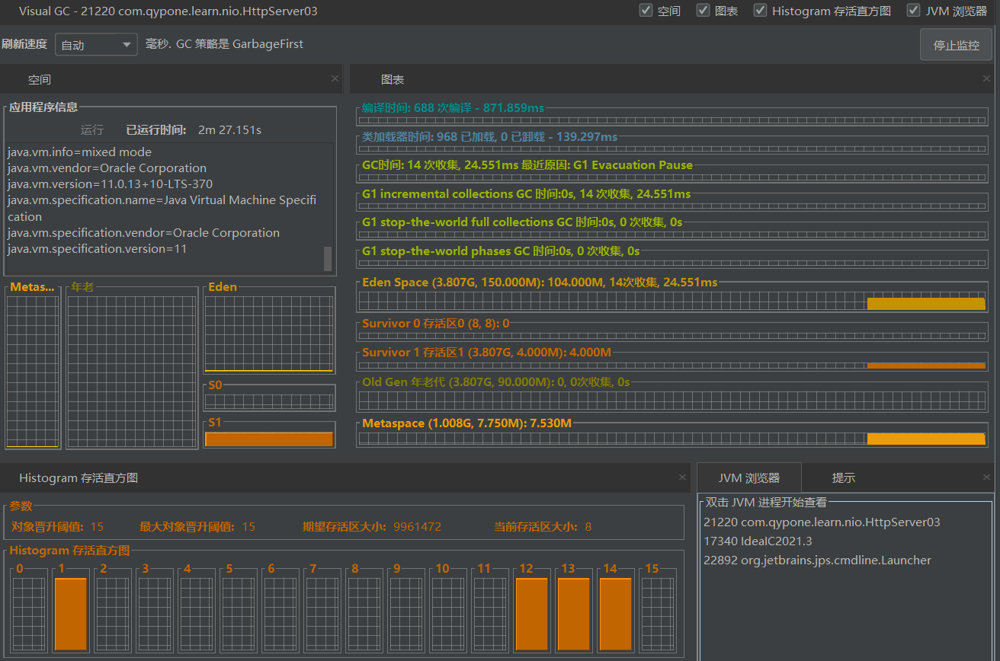

## Socket通信原理



## SuperBenchmarker

压测工具，以下为其github地址，含安装方法和使用介绍

[SuperBenchmarker](https://github.com/aliostad/SuperBenchmarker)

## 测试环境

java11 + G1 + 64位win

注意观察不同程序下，RPS的值，GC的情况

## 单线程的socket程序

```java
public class HttpServer01 {

  public static void main(String[] args) throws IOException{
    ServerSocket serverSocket = new ServerSocket(8801);
    while (true) {
      try {
        Socket socket = serverSocket.accept();
        service(socket);
      } catch (IOException e) {
        e.printStackTrace();
      }
    }
  }

  private static void service(Socket socket) {
    try {
      Thread.sleep(20);
      PrintWriter printWriter = new PrintWriter(socket.getOutputStream(), true);
      printWriter.println("HTTP/1.1 200 OK");
      printWriter.println("Content-Type:text/html;charset=utf-8");
      String body = "hello,nio1";
      printWriter.println("Content-Length:" + body.getBytes().length);
      printWriter.println();
      printWriter.write(body);
      printWriter.close();
      socket.close();
    } catch (Exception e) {
      e.printStackTrace();
    }
  }
}
```

```sh
.\sb.exe -u 'http://localhost:8801' -c 40 -N 60
```





## 每次创建一个线程

```java
public class HttpServer02 {

  public static void main(String[] args) throws IOException {
    ServerSocket serverSocket = new ServerSocket(8802);
    while (true) {
      try {
        final Socket socket = serverSocket.accept();
        new Thread(() -> {
          service(socket);
        }).start();
      } catch (IOException e) {
        e.printStackTrace();
      }
    }
  }

  private static void service(Socket socket) {
    try {
      Thread.sleep(20);
      PrintWriter printWriter = new PrintWriter(socket.getOutputStream(), true);
      printWriter.println("HTTP/1.1 200 OK");
      printWriter.println("Content-Type:text/html;charset=utf-8");
      String body = "hello,nio2";
      printWriter.println("Content-Length:" + body.getBytes().length);
      printWriter.println();
      printWriter.write(body);
      printWriter.close();
      socket.close();
    } catch (Exception e) {
      e.printStackTrace();
    }
  }
}
```

```sh
.\sb.exe -u 'http://localhost:8802' -c 40 -N 60
```





## 使用线程池

```java
public class HttpServer03 {

  public static void main(String[] args) throws IOException{
    ExecutorService executorService = Executors.newFixedThreadPool(
       Runtime.getRuntime().availableProcessors() * 4);
    final ServerSocket serverSocket = new ServerSocket(8803);
    while (true) {
      try {
        final Socket socket = serverSocket.accept();
        executorService.execute(() -> service(socket));
      } catch (IOException e) {
        e.printStackTrace();
      }
    }
  }

  private static void service(Socket socket) {
    try {
      Thread.sleep(20);
      PrintWriter printWriter = new PrintWriter(socket.getOutputStream(), true);
      printWriter.println("HTTP/1.1 200 OK");
      printWriter.println("Content-Type:text/html;charset=utf-8");
      String body = "hello,nio3";
      printWriter.println("Content-Length:" + body.getBytes().length);
      printWriter.println();
      printWriter.write(body);
      printWriter.close();
      socket.close();
    } catch (Exception e) {
      e.printStackTrace();
    }
  }
}
```

```sh
.\sb.exe -u 'http://localhost:8803' -c 40 -N 60
```




